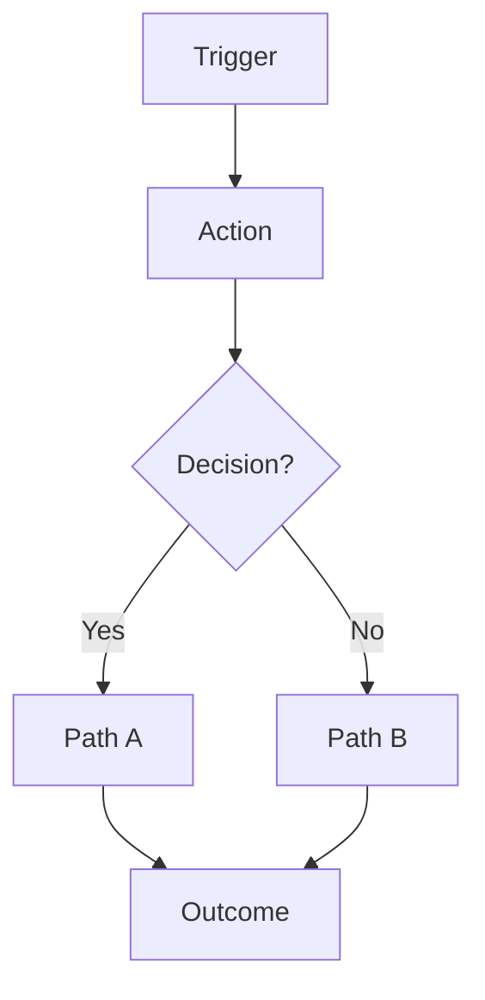

# Execution Plan — {{idea title}}

**Date:** {{YYYY-MM-DD}}
**Tier:** {{T1/T2/T3}} · {{S1/S2/S3}}
**Currency:** {{target-market currency — use consistently}}
**Related docs:** [PRD](PRD.md) · [research](research.md)

> _This is the build roadmap. Someone reading this alone should know exactly what to do Monday morning._

---

## TL;DR

- **MVP:** {{one sentence — the thin slice}}
- **Platform:** {{pick}} — {{one-line reason}}
- **Stack:** {{pick}}
- **Timeline to MVP:** {{N}} weeks
- **First milestone:** {{concrete thing that proves the MVP worked}}

---

## 1. User journey — primary flow

### Text walkthrough

**Step 1 — Trigger.** {{what prompts the user to start; physical/digital context}}
**Step 2 — Context.** {{where they are; what they're feeling}}
**Step 3 — Action.** {{what they do in the product}}
**Step 4 — Outcome.** {{what they get}}
**Step 5 — Feeling.** {{how they feel afterward}}
**Step 6 — Follow-through.** {{what happens next / what brings them back}}

### Mermaid diagram

<!--
Mermaid syntax note: node labels go in [ ] for rectangles and { } for diamonds (decisions).
Replace the placeholder text below but keep the bracket/brace shapes.
Decision nodes need simple text — avoid double-braces or {{ }} inside Mermaid.
-->

_or use `journey` for emotional arc, `sequenceDiagram` for multi-party. See `references/user-journey.md`._

---

## 2. Platform recommendation

**Recommended:** {{web / mobile / desktop / CLI / browser extension / hybrid}}

**Why (tied to research and user journey):**
- {{reason referencing a specific research finding}}
- {{reason referencing user's context from the journey}}
- {{reason referencing distribution/monetization}}

**Alternatives considered:**
- **{{alternative}}** — rejected because {{reason}}
- **{{alternative}}** — rejected because {{reason}}

**Future platforms:** add {{platform}} when {{trigger signal}} — e.g., "add web when >30% of users export notes via email."

---

## 3. Stack recommendation

| Layer | Conservative | Modern (recommended) | Cutting-edge |
|---|---|---|---|
| **Frontend** | {{}} | {{}} | {{}} |
| **Backend** | {{}} | {{}} | {{}} |
| **Database** | {{}} | {{}} | {{}} |
| **Auth** | {{}} | {{}} | {{}} |
| **Hosting** | {{}} | {{}} | {{}} |
| **AI / ML** | {{}} | {{}} | {{}} |
| **Observability** | {{}} | {{}} | {{}} |

**Recommended:** {{option}} because {{2 bullets}}.

**Migration path:** consider switching to {{option}} when {{trigger — e.g., "we hit >1000 DAU with real-time collaboration demand"}}.

---

## 4. Phase breakdown

### Phase 1 — MVP (weeks 0–{{N}})

**Goal:** {{the one question this phase answers — "do users want this at all?"}}

**Scope (the thin vertical slice):**
- {{capability}}
- {{capability}}
- {{capability}}

**Out of scope (tempting but not now):**
- {{thing}}
- {{thing}}

**Journey steps covered:** {{steps 1–N from section 1}}

**Success metrics (North Star + inputs):**
- {{metric}} = {{target}}
- {{metric}} = {{target}}

**Counter-metrics (must not get worse):**
- {{metric}}

**Kill criterion:**
> If by {{date}} we haven't seen {{metric threshold}}, we {{pivot to X / narrow ICP / kill}}.

**How we test it:**
- Recruit {{N}} users from {{source}} for {{length}} beta
- Instrumentation: {{tool + key events}}
- Weekly check-in on metrics

**Distribution (where the first users come from):**
- Primary channel: {{}}
- Backup channel: {{}}
- Founder actions this week: {{3 concrete steps}}
- CAC estimate: {{rough}}
- Signal to switch: {{}}

**Concrete deliverables:**
- [ ] {{deliverable}}
- [ ] {{deliverable}}
- [ ] {{deliverable}}

---

### Phase 2 — v1 (weeks {{N}}–{{M}})

**Goal:** {{the question — "is this becoming a habit / generating revenue / spreading?"}}

**Scope additions over MVP:**
- {{capability}}
- {{capability}}

**Journey steps covered:** {{all of MVP + steps X–Y}}

**Success metrics:**
- {{metric}} = {{target}}
- {{metric}} = {{target}}

**Kill criterion:**
> If by {{date}} we haven't seen {{metric threshold}}, we {{...}}.

**Distribution (what changes from MVP):**
- Primary channel: {{same as MVP / escalate to {{new channel}}}}
- New channel to test: {{paid / partnerships / content / referral loop}} — budget {{}}
- Founder actions this phase: {{2 concrete steps}}
- CAC target: {{rough}}
- Signal to switch: {{}}

**Concrete deliverables:**
- [ ] {{deliverable}}
- [ ] {{deliverable}}

---

### Phase 3 — Target state (beyond v1)

**Vision (written in present tense — what this looks like when it's working):**

> {{2–3 paragraph narrative. Users open this daily / weekly to... The business looks like... The moat is...}}

**Key capabilities to build toward:**
- {{capability}}
- {{capability}}
- {{capability}}

**Scale metrics:**
- {{metric}} = {{target}}
- {{metric}} = {{target}}

---

## 5. Metrics rollup (all phases)

| Phase | North Star | Target | Kill threshold | Key inputs |
|---|---|---|---|---|
| MVP | {{}} | {{}} | {{}} | {{}} |
| v1 | {{}} | {{}} | {{}} | {{}} |
| Target | {{}} | {{}} | — | {{}} |

---

## 6. Immediate next steps (next 1–2 weeks)

Ranked, concrete, small.

1. **{{action}}** — {{owner}} — by {{date}}
2. **{{action}}** — {{owner}} — by {{date}}
3. **{{action}}** — {{owner}} — by {{date}}
4. **{{action}}** — {{owner}} — by {{date}}
5. **{{action}}** — {{owner}} — by {{date}}

---

## 7. Open decisions (to make this week)

- {{decision}} — options: {{A / B / C}} — recommended: {{X}} — why: {{...}}
- {{decision}} — options: {{}} — recommended: {{}} — why: {{...}}

---

## 8. Risks for execution (beyond the product risks in PRD)

| Risk | Likelihood | Impact | Mitigation |
|---|---|---|---|
| {{team / vendor / platform / scope creep}} | L/M/H | L/M/H | {{}} |
| {{}} | L/M/H | L/M/H | {{}} |

---

_Changelog_
- {{YYYY-MM-DD}}: initial draft
