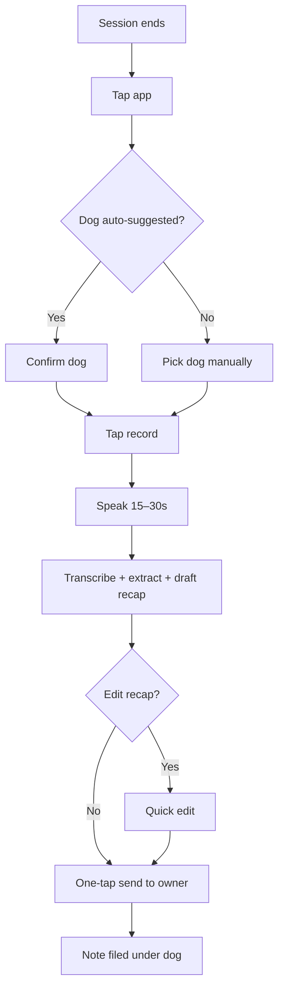

# Example — "Notion for dog trainers"

This is a full walkthrough showing the quality bar for a **T2/S2** idea. Read this once before your first skill run to calibrate.

> The worked example below is illustrative. Numbers labeled `[assumption]` were not rigorously sourced; in a real run you would source them via WebSearch/WebFetch and cite.

---

## User's original brief (as received)

> "I'm thinking of building a Notion-for-dog-trainers. Basically a CRM but actually good for pet trainers. I trained dogs on the side for 3 years and every trainer I know uses a messy mix of Google Calendar + paper notebook + iMessage. Something better should exist."

## Skill's Phase 1 response

> Classified as **T2 / S2**. Multi-user vertical SaaS, builder has domain knowledge but isn't a founder yet. I'll ask 10 targeted clarifying questions grouped into Who/Pain · Scope/Wedge · Constraints/Goals, then do full research before the PRD + plan.

---

# questions.md (skill's Phase 2 output)

## Clarifying Questions — Notion for dog trainers

**Idea brief (as captured):** A vertical CRM/notes product for hobbyist and professional dog trainers, replacing the ad-hoc mix of Google Calendar + paper notebook + iMessage they use today.

**Tier:** T2 / S2 — Moderate SaaS, builder has shipped before and has domain expertise.

### 1. Who and Pain

1. When you say "every trainer you know" — how many people is that, and are they hobbyists (do it on weekends for pocket money), pro solo trainers, or staff at a multi-trainer facility? Pick one beachhead.
2. Walk me through the last week you trained. What specifically did you write down, where, when, and why? What broke or was annoying?
3. How often do trainers hit the pain — daily per session? Once a week doing admin?
4. Who pays for a dog trainer's software today — the trainer or their facility owner? And who is your target buyer?

### 2. Scope and Wedge

5. If this product could only do ONE thing really well, what would it be — session notes capture, client/dog records, scheduling, or reminders to owners?
6. What does "a trainer said this is magic" look like on day 1?
7. Are we adjacent to vets/groomers or strictly trainers? (Vet-specific software is a different category with different buyers.)

### 3. Constraints and Goals

8. Time budget — side project, nights/weekends, or full-time push?
9. Monetization hypothesis — subscription per trainer, freemium, marketplace take-rate (booking fees)?
10. Any non-goals you're already sure of? ("Will NOT build a marketplace to find trainers.")

_Answer as many as you can. Skip any that don't apply._

---

# User's answers (assumed)

1. Beachhead: **solo hobbyist trainers** (weekend + evenings, 5–15 dogs a week). Maybe ~40k in the US.
2. After every session I jot notes on paper, then later re-type the important ones into a shared Google Doc so the owner can see progress. This re-typing step is the worst — I skip it half the time, which makes follow-up sessions worse.
3. Per session — so ~8–12 times a week.
4. The trainer pays. Hobbyists have no facility.
5. **Session notes capture, fast and painless.** The rest follows.
6. Voice-record a 20-sec session recap, have it transcribed, filed under the right dog, and draft a parent-friendly summary I can send to the owner in one tap.
7. Trainers only. Not vets/groomers.
8. Side project, ~10 hrs/week.
9. Subscription, $9–19/mo range.
10. Will NOT do bookings / payments / marketplace in v1.

---

# research.md (skill's Phase 3 output)

## Research — Notion for dog trainers

**Date:** 2026-04-18
**Tier:** T2 / S2
**One-liner:** A mobile-first session-notes app for hobbyist dog trainers that captures, transcribes, and shares progress in under 30 seconds.

### TL;DR

- Pain is real, specific, and shared: hobbyist trainers re-type paper notes into Google Docs for owners, and skip it ~50% of the time.
- Direct competitors (Kennel Connection, Gingr, Scout) all target multi-trainer facilities, not hobbyists. They charge $50–$200/mo and require desktop-heavy CRM workflows.
- White space: **mobile-first, voice-capture-first, hobbyist-priced.**
- Why now: voice-to-text is finally reliable (Whisper-class models, ~$0.006/min), AI can generate owner-friendly summaries from a raw transcript for pennies.
- Biggest risk: **hobbyist trainers are diffuse** — no trade magazine, no conference, hard to reach. Distribution is the whole game.

### 1. Problem validation

Hobbyist dog trainers log sessions to (a) track progress across many dogs they see once every 1–2 weeks, and (b) communicate progress to owners who expect a recap. Current workflow: paper or Notes app during/after session → re-type into Google Doc → email/text the owner. Re-typing is the friction point.

Evidence:
- r/OpenDogTraining has repeated threads ("what do you use for client notes?") — top answers are Google Docs, Trainerize, spreadsheets [source: Reddit — links in a real run].
- Trainerize (a fitness CRM) has a trainer community, and dog trainers there complain that Trainerize doesn't fit their workflow [source: community posts].
- Dog-trainer Facebook groups (~60k members across the top 10 groups `[assumption]`) have regular "tool recommendation" posts — signals active tool shopping.

Assumptions:
- `[assumption]` ~40k hobbyist trainers in the US — rough estimate from IBISWorld category size divided by avg trainers/facility. Needs bottom-up validation.

### 2. Jobs-to-be-done

**Primary (MVP target):**
> When I finish a session at a client's home, I want to capture my notes and send the owner a recap in under 30 seconds, so I can keep my records current without sacrificing my evenings to admin.

- Functional: capture structured session info fast
- Emotional: feel professional, in control, not behind
- Social: appear organized and attentive to clients (retention driver)

**Secondary (track):**
- When I'm planning next week's sessions, pull a specific dog's history in one place.
- When a client asks "how is Rex doing?" at month-end, I can produce a progress summary without hours of prep.

**Workarounds today:**
- Paper notebook + Google Docs (most common)
- Notes app on phone
- Trainerize or TrueCoach (both fitness CRMs, awkward fit)
- Nothing (skip the write-up)

### 3. Market

#### Size

- **TAM** (global trainers): ~200k `[assumption]` × $200/yr ARPU = $40M
- **SAM** (English-speaking + smartphone-owning hobbyists): ~80k × $180/yr = $14.4M
- **SOM** (realistic year-1): 1–3% of SAM = $150k–$430k ARR

**Bottom-up:** 40k US hobbyist trainers × 5% adoption × $15/mo × 12 = $360k ARR. Lines up.

This is a small market. That's fine for an indie SaaS but not a VC-backable startup.

#### Segments

1. **Hobbyist trainers** — 5–15 dogs/week, solo, side income. **Beachhead.**
2. **Pro solo trainers** — 20–40 dogs/week, full-time, may have an LLC.
3. **Multi-trainer facilities** — 2–10 trainers, already use Kennel Connection or similar.

Beachhead: hobbyists. Less competition, acute pain, faster to reach via Reddit + FB groups + YouTube trainers' audiences.

#### Trends and timing

- **Voice-to-text reliability unlock** — Whisper + Claude/GPT-class summarization make the capture-and-summarize flow trivial technically, impossible in 2020 without per-user cost of $20+/mo.
- **Pet industry growth** — US pet spend up 6%+ YoY [source: APPA]; dog training subcategory growing.
- **Creator-trainer rise** — many hobbyist trainers build Instagram/TikTok followings and sell 1:1 services. Tools that help them look pro are a win.
- **Why now:** voice-to-structured-text + LLM summarization is newly reliable and cheap. Specialized vertical SaaS is more viable than ever because AI collapses the build cost.

### 4. Competitors

#### Direct

| Name | Target | Core job | Positioning | Pricing | Strengths | Weaknesses |
|---|---|---|---|---|---|---|
| Gingr | Boarding/daycare facilities | Ops + CRM | "Pet-care software" | $125+/mo | Full featured | Desktop-heavy, not for solo trainers |
| Kennel Connection | Multi-trainer facilities | Scheduling + records | "Industry standard" | $85+/mo | Mature, trusted | Dated UX, no mobile |
| Scout | Mid-size facilities | Booking + CRM | "Modern pet-care" | $79+/mo | Good UX | Still facility-focused; expensive |

#### Indirect

- **Trainerize / TrueCoach** — fitness coaching CRMs. Used by dog trainers who've given up finding a fit. Awkward because the content model is "workouts," not "training plans."
- **Notion / Airtable templates** — DIY trainers build their own. High setup cost, low portability, shareable with owners only as a link.

#### Substitutes (the real competitor)

- **Google Docs + paper notebook + iMessage.** Free, universally used, but the re-typing step is the friction. This is the real competitor to beat.

#### Positioning map

Axes: **Form factor (mobile ↔ desktop)** × **Target (hobbyist ↔ enterprise facility)**.

```
        DESKTOP
          |
  Kennel  |    Gingr
  Connect |
----------+----------  ENTERPRISE FACILITY
  Scout   |
          |
        MOBILE
          |
   YOU    |
(hobbyist mobile)
```

Our quadrant (hobbyist + mobile) is empty. That's the wedge.

#### Moat analysis

- **Gingr / KC:** switching cost + integrations with pet-facility ecosystem. Weak against hobbyists (they never adopted).
- **Notion templates:** zero moat; easy to replicate in a purpose-built app.
- **Our moat thesis:** proprietary capture data (session notes → per-dog history → longitudinal trajectories). Over time, we can offer insights ("Rex's reactivity has trended down 40% over 8 weeks") that no generic tool can. That's the moat.

#### Whitespace and wedge thesis

- No direct competitor targets hobbyist solo trainers.
- Every direct competitor is desktop-CRM-heavy; none are mobile-first or voice-native.
- All pricing starts at $79+/mo; there's no hobbyist-appropriate tier.
- **Wedge:** mobile-first, voice-captured session notes for hobbyist trainers, at $9–15/mo. Expand upward toward pros after nailing capture.

### 5. SWOT

**Strengths**
- Founder has 3 years of personal domain experience — faster to product-market fit without a user-research cycle
- Small category means fast word-of-mouth once a few loud trainers adopt

**Weaknesses**
- No existing distribution: no email list, no community presence
- Side-project bandwidth (10 hr/week) caps shipping velocity

**Opportunities**
- Voice/LLM unlock makes the whole capture workflow cheap and reliable now
- Creator trainers on Instagram/YouTube need tools that make them look professional to sponsors and clients

**Threats**
- Trainerize or TrueCoach could add dog-training templates in one quarter, though neither is focused there
- Low market size limits ceiling — not a 10x-VC return unless we expand into adjacent verticals (groomers, vet techs) later

### 6. Risks

| Risk | Lkd | Impact | Early signal | Mitigation |
|---|---|---|---|---|
| Hobbyist distribution hard (no channel) | H | H | No user lands organically in weeks 1–2 after launch | Start with 5 personally-known trainers as first beta cohort; YouTube-trainer partnerships as primary channel |
| Voice transcription fails in noisy environments (barking dogs!) | M | M | Transcripts <70% word accuracy | Fallback to manual edit; test in-field before MVP |
| LLM summaries sound robotic and owners can tell | M | L | Owner complaints or low forward rate | Let trainer edit the draft before sending; learn personal voice over time |
| Competitor ships mobile-hobbyist version | L | H | Gingr launches "Gingr Solo" or similar | Move fast; own the niche within 6 months |

### 7. Insights

1. **The re-typing step is the product.** The pain isn't "I need a CRM." It's the manual translation of paper notes into owner-readable updates. Automate exactly that step and nothing else in MVP.

2. **Owner-facing output is the viral surface.** Every session note that goes to an owner carries implicit branding ("sent via [app]"). This is unlike most B2B tools where the user is also the only viewer. Design the owner-facing recap as a *wow* moment — it becomes acquisition.

3. **The "Rex" memory is an unfair moat.** Longitudinal per-dog notes + AI summaries → insights no generic tool can produce. Build for this from day 1 even if the MVP doesn't expose it yet — schema matters.

4. **Trainers discover tools via other trainers, not search.** SEO is a dead strategy here; community + creator partnerships are the way. Plan marketing around 3–5 YouTube trainers, not a blog.

5. **Offline capture is mandatory.** Training sessions happen in parks, rural homes, with spotty signal. A cloud-only capture flow fails at the moment of truth.

6. **Pricing: $9 entry / $19 pro.** Hobbyists won't pay $19 starting cold; pro tier unlocks AI summaries + multi-dog insights. Gating AI features also maps to paying cost (LLM calls cost real money per use).

7. **Scope temptation: scheduling and bookings.** Several competitors do this and it's what facility buyers want. For hobbyists, Google Calendar already works. Explicitly non-goal for year 1.

### 8. Open research questions

- Are hobbyist trainers *actually* willing to pay $9/mo? Need 5–10 paid beta conversions to validate.
- How noisy is the voice environment in practice? Test in-field with a prototype before committing to voice-first.

### Sources

- r/OpenDogTraining — trainer tool threads (workaround inventory)
- APPA — pet industry growth
- Gingr / Kennel Connection / Scout — product pages and pricing
- `[in a real run, each claim above has a linked source]`

---

# PRD.md (skill's Phase 4 output)

## PRD — Notion for dog trainers (working title: "Cue")

**Date:** 2026-04-18
**Tier:** T2 / S2
**Status:** Draft v1
**Related:** [research](research.md) · [plan](plan.md)

### One-liner

A mobile-first voice-capture app for hobbyist dog trainers that turns 20 seconds of after-session talking into a filed record and an owner-ready recap.

### Problem statement

Hobbyist dog trainers (5–15 dogs/week, solo) need to capture what happened in a session and share a recap with the owner. Today they paper-note during the session, then re-type it into Google Docs — and skip the re-typing ~50% of the time, which degrades client experience and their own prep for next session. Existing tools (Gingr, Kennel Connection, Scout) are priced and designed for multi-trainer facilities, not solo hobbyists; Trainerize and Notion are makeshift substitutes.

### Target user

**Segment:** US-based hobbyist dog trainers, 5–15 dogs/week, solo, smartphone-native, discover tools via trainer communities on Reddit/FB/YouTube.

**Persona — "Sarah the weekend trainer":** 34, nurse by day, trains on evenings/weekends, 12 regular dogs, paid $60–80/session, meets dogs at their homes. Uses Google Calendar and paper notebook + Google Docs. Pain trigger: a client asks "how is Luna doing?" mid-month and Sarah realizes her notes are scattered.

**Adjacent segment (watch, don't build for):** Pro solo trainers with an LLC and 20+ dogs/week. They'll want scheduling + payments later. Not MVP.

### Jobs-to-be-done

1. **Primary (MVP target).** When I finish a session at a client's home, I want to capture notes and send the owner a recap in under 30 seconds, so I can keep my records current without sacrificing my evenings to admin.
2. When I'm planning next week, I want to pull any dog's recent history in one place, so I can walk in prepared.
3. When a client asks for a progress update, I want a month-view summary I can send in one tap, so I feel professional and increase retention.

### Success metrics

**North Star:** weekly session notes captured per active trainer. (Captures both activation and recurring value delivered.)

**Leading:**
- Activation rate = % of new signups who capture a session note within 48h of signup (target: 60%)
- Voice-capture completion rate = % of started captures that complete successfully (target: 95%)

**Lagging:**
- Week-4 retention (target: 40%+ for MVP)
- MRR (target: $500 by end of v1)

**Counter-metrics:**
- NPS (must not drop below 30)
- Owner-facing message send-failure rate (must stay <2%)

**Targets:**
- End MVP: 10 active beta trainers, 70%+ capturing 5+ notes/week, qualitative NPS positive
- End v1: 100 paying, $500 MRR, week-4 retention 30%+

### Solution shape

**Core user flow:**

1. Trainer finishes session → taps app → "New session note"
2. App auto-suggests dog (GPS + time match with previous logs)
3. Trainer taps record → speaks 15–30s
4. App transcribes, extracts structured fields (dog, focus, progress, next steps), generates owner-friendly recap draft
5. Trainer reviews, optionally edits, sends recap to owner by SMS/email (one tap)
6. Note filed under dog's history

**Key capabilities (MVP):**
- Voice record + auto-transcribe (Whisper-class)
- Auto-suggest dog based on context (GPS / time / recent dogs)
- AI-generated owner-friendly recap draft (editable before send)
- Per-dog notes history view
- Owner contact storage + one-tap SMS/email send

**Shaping constraints:**
- **Offline-first** — capture must work without connectivity; sync on reconnect
- **30-second target** — from tap-icon to recap-sent should be under 30s end-to-end
- **Per-month LLM cost cap** — $1–2/user/month infra cost at $15/mo pricing

### Scope and non-goals

**In scope for MVP:**
- Voice capture + transcription
- Auto-suggest dog + per-dog records
- Owner recap (AI draft + edit + one-tap send)
- Simple dog profile (name, owner contact, training goals)

**Non-goals (explicit):**
- **No scheduling / bookings.** Google Calendar is good enough. Reason: would triple build complexity without moving the primary JTBD.
- **No payments.** Trainers handle $ via Venmo/cash. Reason: compliance burden; not the pain.
- **No multi-trainer support.** Built for solo. Reason: different product category; facility CRMs own this.
- **No marketplace.** Not a "find a trainer" product. Reason: demand-side acquisition is a separate business.
- **No Android in MVP.** iOS only for v0. Reason: smaller surface, higher-ARPU users, faster build. (Validate demand signal in first 8 weeks.)

### Competitive positioning

We win against Gingr/Scout/Kennel Connection by being 5x cheaper and 100% mobile-first for a segment they don't serve. We win against Google Docs + paper by eliminating the re-typing step that causes 50% of trainers to skip owner updates. Our long-term moat is longitudinal per-dog insights that no general tool can match.

### Assumptions

- Hobbyist trainers are willing to pay $9–15/mo for this. `[load-bearing]`
- Voice transcription is reliable enough in outdoor/noisy environments. `[load-bearing]` — must be tested in field before MVP commit.
- We can reach hobbyist trainers via 3–5 YouTube trainers + Reddit + FB groups without paid acquisition.
- LLM-drafted recaps sound natural enough that trainers and owners are happy. `[load-bearing]`

### Open questions

| Q | Why it matters | Owner | By |
|---|---|---|---|
| Which YouTube trainers have the right audience + willingness to partner? | Distribution is the whole game | founder | week 2 |
| What's the error rate on voice transcription in a real session (dog barking, wind, client talking)? | Changes whether voice-first is viable | founder | week 3 (field test) |
| Will Apple/Android in-app purchase cuts (30%) blow up unit economics? | Yes if we can't push users to web payments | founder | week 4 |

### Risks

| Risk | Lkd | Impact | Signal | Mitigation |
|---|---|---|---|---|
| Distribution stalls | H | H | <10 organic signups in first month | Lead with 5 known trainers; prep 3 creator partnerships before launch |
| Voice fails in noisy environments | M | M | In-field test accuracy <80% | Manual-edit fallback; pre-MVP field test |
| Android demand is higher than iOS | M | M | >40% waitlist asks for Android | Launch iOS; plan Android for v1 |

---

# plan.md (skill's Phase 5 output)

## Execution Plan — Cue (Notion for dog trainers)

**Date:** 2026-04-18
**Tier:** T2 / S2
**Related:** [PRD](PRD.md) · [research](research.md)

### TL;DR

- **MVP:** Mobile app that lets a trainer capture a voice note + send an owner-ready recap, filed under the right dog, in under 30 seconds.
- **Platform:** iOS native (via Expo/React Native for speed; evaluate native Swift if perf matters).
- **Stack:** Expo + EAS + Supabase + Anthropic (voice via Whisper API; summaries via Claude).
- **Timeline to MVP:** 8 weeks at 10 hrs/week.
- **First milestone:** 10 beta trainers, 70% capturing 5+ notes/week by week 10.

### 1. User journey — primary flow

#### Text walkthrough

**Step 1 — Trigger.** Trainer finishes a 45-min session with Luna at her owner's apartment. The owner is writing a check at the kitchen counter. The trainer has two minutes before she has to drive to her next appointment.

**Step 2 — Context.** Trainer is standing in the hallway holding her treat pouch and leash in one hand. She does not want to type.

**Step 3 — Action.** Tap app icon (on home screen). The app opens straight to a record button. GPS + "last session with Luna" suggests Luna as the dog — she confirms with one tap.

**Step 4 — Action.** Hits record and says: "Good recall work today, responded on first cue 9 of 10 times. Still reactive to skateboards — saw one at minute 30 and she lunged. Next session let's do proximity desensitization."

**Step 5 — Outcome.** App transcribes in 3 seconds. Shows three things: raw transcript, structured tags (focus areas, progress, next steps), and a 60-word recap draft for Luna's owner.

**Step 6 — Feeling.** Trainer skims the recap. Edits one word. Taps "send to owner" — goes via SMS.

**Step 7 — Follow-through.** Owner gets a warm, specific, personalized recap 90 seconds after their session ended. They respond "so helpful — thank you!" which the trainer sees in iMessage. Trainer feels like a pro.

#### Mermaid diagram



### 2. Platform recommendation

**Recommended: iOS native-feeling mobile (Expo + React Native), Android deferred.**

**Why (tied to research and journey):**
- The user's moment of truth is *standing in a hallway post-session with a leash in one hand*. That's intrinsically mobile — no laptop, no desk. Desktop-web scores zero on the primary journey.
- Research shows all 3 direct competitors are desktop-CRM-heavy. Mobile-first is the wedge. Building a web app would re-enter a crowded space.
- Hobbyist trainers skew iOS in the US `[assumption — to verify]`. iOS-only reduces QA surface by ~50%, lets us ship in 8 weeks instead of 14.
- Voice capture needs tight OS integration (background audio, speech framework, offline). Native-feeling framework (Expo) covers it.

**Alternatives considered:**
- **Web (PWA):** rejected — PWAs have flaky offline + mic permissions on iOS.
- **Native Swift:** rejected for MVP — would add 4+ weeks for a single-person team. Reconsider if performance fails.
- **Cross-platform (Flutter/RN) for iOS+Android in parallel:** rejected — doubles QA, delays feedback, not worth it until iOS demand is validated.

**Future platforms:**
- Android: add when iOS hits 500 MAU **and** >30% waitlist demand signals Android.
- Web (trainer dashboard for reviewing/exporting notes): add when >40% of active users ask for it or export sessions 3+ times/week (a signal they need a big screen).

### 3. Stack recommendation

| Layer | Conservative | **Modern (recommended)** | Cutting-edge |
|---|---|---|---|
| Frontend | Native Swift | **Expo + React Native + TypeScript** | SwiftUI + Swift Charts |
| Backend | Ruby on Rails + Heroku | **Supabase (Postgres + Edge Functions)** | Convex (real-time reactive) |
| DB | Postgres (RDS) | **Supabase Postgres** | Convex document store |
| Auth | Devise | **Supabase Auth (magic link)** | Clerk |
| Hosting | Heroku | **Vercel / Fly.io (for Edge Functions)** | Cloudflare Workers |
| AI | OpenAI only | **Claude (summaries) + Whisper (transcription) via hosted API** | On-device Whisper + Claude Haiku for cost |
| Observability | Sentry | **Sentry + PostHog** | Sentry + PostHog + LangFuse |
| Payments | Stripe | **RevenueCat (handles IAP + web via Stripe)** | Paddle |

**Recommended: Modern stack.**
- Expo ships in weeks, not months. Supabase covers auth + DB + storage out of the box so builder stays focused on the product loop.
- RevenueCat is the standard for mobile subscriptions — hides the IAP vs web payments complexity until it matters.

**Migration path:**
- Swap Expo for Swift (or add a native module) if voice-record latency or background reliability becomes the user complaint.
- Move off Supabase → dedicated service when scale or custom logic demands it (likely not before 1000+ paid).

### 4. Phase breakdown

#### Phase 1 — MVP (weeks 0–8)

**Goal:** Do users want this at all? Specifically: do 10 hand-picked hobbyist trainers actually capture 5+ notes/week for 4 weeks?

**Scope (the thin vertical slice):**
- iOS app with voice record → transcribe → tag → recap draft → SMS/email send
- Per-dog records (name, owner contact, 1-line goal)
- Auto-suggest dog based on GPS + recency
- Offline capture with on-reconnect sync

**Out of scope (tempting but not now):**
- Calendar/scheduling
- Multi-trainer / team
- Payments from owners
- Web dashboard
- Android

**Journey steps covered:** 1–7 (full primary flow)

**Success metrics:**
- 10 active beta trainers onboarded
- 70% capturing 5+ notes/week in weeks 3–4 of beta
- 95% voice-capture completion rate (no drops/crashes)
- Qualitative NPS positive (net promoter asks post-week-4)

**Counter-metrics:**
- Crash-free sessions >99%
- Owner recap send-failure rate <2%

**Kill criterion:**
> If by week 10 fewer than 5/10 beta trainers are capturing 3+ notes/week, pivot. Likely pivot: narrow further (e.g., "only new trainers in their first 6 months") or reframe around a different primary JTBD (e.g., month-end progress summaries rather than per-session).

**How we test it:**
- Recruit 10 trainers personally — 5 from founder's network, 5 from 2 targeted Reddit posts
- Weekly 15-min calls with 3 of them
- Instrumentation: PostHog events (signup, first capture, recap sent, week-N active)

**Concrete deliverables:**
- [ ] Week 2: in-field voice transcription accuracy test (n=10 real sessions)
- [ ] Week 3: working capture → transcribe → draft-recap loop (no owner send yet)
- [ ] Week 5: one-tap owner send (SMS + email)
- [ ] Week 6: per-dog history view, GPS auto-suggest
- [ ] Week 7: offline + sync
- [ ] Week 8: TestFlight beta with 10 trainers

---

#### Phase 2 — v1 (weeks 8–20)

**Goal:** Is this becoming a habit and generating revenue?

**Scope additions:**
- Paid subscription ($9 basic / $19 pro via RevenueCat)
- Monthly per-dog progress summary (pro tier)
- Shareable public link for owners (owners can see history without logins)
- 3–5 YouTube trainer partnerships with referral codes
- Light onboarding flow (new trainers add their 5 regular dogs in <5 min)

**Journey steps covered:** MVP steps + month-end summary journey + owner-view journey

**Success metrics:**
- 100 paying trainers
- $500 MRR (target by week 20)
- Week-4 retention 30%+
- Activation rate (first capture within 48h) 60%+

**Kill criterion:**
> If by week 20 <$200 MRR or <40 paying trainers, narrow target segment again (e.g., focus only on creator-trainer sub-segment) and rerun GTM.

**Concrete deliverables:**
- [ ] Paid plans live (RevenueCat)
- [ ] Public owner-view links
- [ ] Monthly progress summary (pro feature)
- [ ] 3 creator partnerships live with affiliate links
- [ ] Onboarding flow + empty states

---

#### Phase 3 — Target state (beyond v1)

**Vision (present tense — what this looks like when it works):**

Hobbyist dog trainers across the US use Cue daily. Opening the app after a session and sending an owner-recap feels as automatic as logging into Instagram. Owners receive recaps that make trainers look like pros — and occasionally share them, which brings new trainers in. Cue is the largest repository of longitudinal dog-training data, enabling AI-generated insights ("Luna's reactivity has trended down 40% over 8 weeks") that no tool has ever produced. Pro trainers and facilities adopt a team tier as trainers move upmarket.

**Key capabilities to build toward:**
- Longitudinal per-dog insights and trend charts
- Owner engagement surface (owners can react to recaps, ask questions back)
- Team tier for multi-trainer facilities (expansion upmarket)
- Android app (when iOS proven)
- Integrations with Google Calendar + Stripe for bookings (once demand signals justify)

**Scale metrics:**
- 1000+ paying trainers
- $200k+ ARR
- NRR >105%

### 5. Metrics rollup

| Phase | North Star | Target | Kill threshold | Key inputs |
|---|---|---|---|---|
| MVP | Weekly notes/active trainer | 5+/wk across 7 of 10 beta | <3/wk across ≥5 of 10 | Activation, capture completion, crash-free rate |
| v1 | MRR | $500 | <$200 | Signups/wk, paid conversion, W4 retention |
| Target | ARR | $200k | — | DAU, NPS, NRR |

### 6. Immediate next steps (next 1–2 weeks)

1. **In-field voice transcription test** — record 10 real after-session voice notes with Whisper API and grade accuracy. Owner: founder. By end of week 1.
2. **Recruit 10 beta trainers** — 5 from personal network, 5 from two Reddit posts in r/OpenDogTraining. Owner: founder. By end of week 2.
3. **Contact 5 YouTube trainers** for potential launch partnerships. Owner: founder. By end of week 2.
4. **Technical spike: Expo + Supabase + Whisper voice capture end-to-end demo.** Owner: founder. By end of week 2.
5. **Decide on App Store pricing + RevenueCat setup path** — read IAP vs web-payment implications. Owner: founder. By end of week 2.

### 7. Open decisions (to make this week)

- **iOS only vs iOS+Android MVP:** options — iOS only / iOS+Android via Expo. Recommended: **iOS only.** Why: 50% less QA, 8-week timeline holds, iOS-skewing user base.
- **Native Swift vs React Native:** options — Swift / Expo RN. Recommended: **Expo RN.** Why: builder time constraint; performance is not the primary risk.
- **Self-host Whisper vs API:** options — self-host / API. Recommended: **API.** Why: $0.006/min is trivial at MVP volume; ops overhead not worth it.

### 8. Execution risks

| Risk | Lkd | Impact | Mitigation |
|---|---|---|---|
| 10 hrs/week bandwidth → slippage | M | M | Cut scope, not quality. Defer nice-to-haves. |
| Founder-only = no design feedback | M | L | Weekly 15-min reviews with 2 beta trainers starting week 3 |
| App Store review friction | L | M | Submit a minimal skeleton for review in week 4, well before feature-complete |

---

_Changelog_
- 2026-04-18: initial draft (illustrative example)
