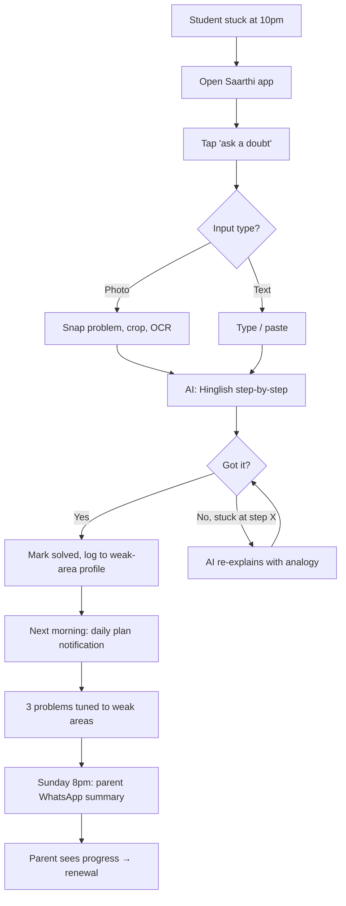

# Execution Plan — Saarthi (AI Study Companion for JEE)

**Date:** 2026-04-18
**Tier:** T2 / S2
**Related docs:** [PRD](PRD.md) · [research](research.md) · [questions](questions.md)

> _This is the build roadmap. Someone reading this alone should know exactly what to do Monday morning._

---

## TL;DR

- **MVP:** A mobile app where a JEE dropper snaps a photo of a stuck problem → gets a 10-second Hinglish step-by-step explanation → and sees a 3-problem daily plan tuned to their weak chapters. Parents get a weekly WhatsApp progress summary.
- **Platform:** **Mobile-first (Android primary, iOS secondary).** The user's moment of truth is 10:45pm at a study desk in Patna with a phone, not a laptop; tier-2/3 is Android-heavy at ~90%+ share.
- **Stack:** **Modern** — Expo + React Native (Android-first build) + Supabase (Postgres + Auth + Storage) + Anthropic Claude (reasoning) + OpenAI Whisper (voice, later) + Razorpay (UPI) + Meta WhatsApp Business API (parent summaries).
- **Timeline to MVP:** **10 weeks** full-time solo.
- **First milestone:** 50 beta signups, 20 paid, 15 active in week 4 of their subscription, 60% D1 activation.

---

## 1. User journey — primary flow

### Text walkthrough

**Step 1 — Trigger.** It's 10:45pm. Rahul (18, dropper, Patna) is working through a Rotational Dynamics problem from Cengage Physics. He tries two approaches, both give wrong answers. The Telegram group is dead at this hour. His coaching class is offline tomorrow, 9am — 10 hours away.

**Step 2 — Context.** Single-room study corner. Phone on desk. Charger at 60%. Overhead fan on. Mom is asleep. He wants to solve this one problem, finish the topic, then sleep by 12.

**Step 3 — Action.** He opens Saarthi (one tap — home screen icon). App opens to a giant "ask a doubt" button. He taps it, snaps a photo of the problem, crops to just the problem statement.

**Step 4 — Action.** App OCRs the problem in 1 second. Shows what it read back: _"A uniform rod of mass M and length L is pivoted at one end..."_ Rahul taps "haan, yahi hai."

**Step 5 — Outcome.** In 4 seconds, a Hinglish explanation streams in: *"Pehle samajhte hain ye kaunsi situation hai — rod is being pivoted, so rotational motion lagega. Step 1: Torque calculate karein about pivot..."* Intermediate checkpoints: *"Yahan tak clear hai?"* with thumbs up/down.

**Step 6 — Outcome.** Rahul follows along. On step 4, he doesn't get why tangential acceleration is used. Taps "yahan atka hoon." AI re-explains with an analogy: *"Jaise ceiling fan ka blade — blade ke end pe tangential acc zyada, center pe kam..."*

**Step 7 — Feeling.** Clicked. He marks "got it" on the doubt. App logs: chapter = Rotational Dynamics, subtopic = Pivoted Rod, confidence-after-explanation = medium.

**Step 8 — Follow-through.** Notification next morning at 8am: "Aaj ka plan: 2 rotational problems (tumne kal atka tha), 1 mechanics revision." He taps in, solves 2 of 3 before breakfast. Feels on track.

**Step 9 — Parent loop.** Sunday 8pm, Dad gets a WhatsApp from Saarthi: _"Rahul ne is hafte 42 problems solve kiye, 1h 47min avg study time. Strong: Electrochemistry. Weak: Rotational Dynamics (next week focus)."_ Dad shows Mom. They feel the ₹299 is working.

### Mermaid diagram

---

## 2. Platform recommendation

**Recommended:** **Mobile-first, Android primary + iOS secondary** (Expo / React Native to cover both with one codebase, Android-first prioritization for testing + release).

**Why (tied to research and user journey):**
- The user's moment of truth is *at a study desk, late at night, with a phone in hand and a physical textbook open*. Research shows tier-2/3 students are smartphone-primary — 70%+ of new smartphone sales in India come from tier-2/3 [Storyboard18](https://www.storyboard18.com/digital/660-million-smartphone-users-16-17-billion-monthly-upi-transactions-power-digital-bharat-report-89731.htm). Desktop/web scores zero on the primary journey.
- Photo-capture is the fastest input — students point at printed textbook problems, not re-type them. This is intrinsically mobile (OS camera, tight integration).
- Android dominates tier-2/3 at ~90%+ share; iOS is a tier-1 phenomenon. Shipping Android-first lets us validate in the actual target segment, not in cosmopolitan early-adopter bubbles.
- WhatsApp parent loop requires phone-number-native distribution; push notifications and deep links work best on mobile native.

**Alternatives considered:**
- **Web (PWA):** rejected — PWA camera permissions on Android are flaky; push notifications are weaker; "install to home screen" conversion is <15% vs app-store install. For habit products, app-store install is non-negotiable.
- **Native Android only (Kotlin):** rejected for MVP — solo founder can't maintain two codebases, and iOS parents in tier-1 (eventual expansion) matter for PR and tier-2 aspiration.
- **WhatsApp chatbot only:** rejected as primary — can't handle photo OCR + rich rendering + step-by-step pedagogy well; WhatsApp is a distribution surface (parent summaries) not the primary product.

**Future platforms:**
- **iOS polish + App Store launch** — when we hit 2,000 Android MAU (signals cross-tier resonance).
- **Web dashboard (student portal for mock-test analytics)** — when >30% of paid users ask for bigger-screen mock-test review or when mock-test analytics becomes the v1 upsell driver.
- **WhatsApp-native doubt solver** — when cost economics allow; lower friction than an app install but weaker personalization loop.

---

## 3. Stack recommendation

| Layer | Conservative | **Modern (recommended)** | Cutting-edge |
|---|---|---|---|
| **Frontend** | Native Android (Kotlin + Jetpack Compose) | **Expo + React Native + TypeScript** | Flutter + Dart |
| **Backend** | Ruby on Rails + Heroku | **Supabase (Postgres + Edge Functions) + Node.js** | Convex (real-time reactive) |
| **Database** | Postgres on RDS | **Supabase Postgres + pgvector for embeddings** | Convex document store |
| **Auth** | Custom JWT + phone-OTP | **Supabase Auth + phone-OTP via MSG91** | Clerk |
| **Hosting** | AWS EC2 / Heroku | **Vercel (edge functions) + Supabase** | Cloudflare Workers + D1 |
| **AI / ML** | OpenAI API only | **Anthropic Claude (primary) + GPT-4o-mini (cost tier) + SymPy (math symbolic) + Vision API for OCR** | Self-hosted Llama 3.3 / Mistral + on-device Whisper |
| **Payments** | Stripe (weak in India) | **Razorpay (UPI, cards, netbanking)** | Cashfree / Juspay |
| **WhatsApp parent loop** | n/a (email) | **Meta WhatsApp Business API via Gupshup / Interakt** | Direct Meta partnership |
| **Observability** | Sentry | **Sentry + PostHog + LangFuse (LLM traces)** | Sentry + Datadog + custom |
| **Analytics** | GA4 | **PostHog (events, funnels, session replay)** | Amplitude |

**Recommended: Modern stack.**
- Expo ships both Android and iOS from one codebase — critical for a solo founder. Supabase replaces 3 vendors (DB, Auth, Storage, Edge Functions) with one bill and one dashboard. Anthropic Claude is best-in-class on step-by-step reasoning; GPT-4o-mini handles cheap tier for simple doubts; SymPy gives numeric reliability on math where LLMs hallucinate.
- Razorpay is the India payment standard — UPI integration is non-negotiable for tier-2/3 (no one pays by card at ₹299/mo). WhatsApp Business API via Gupshup/Interakt avoids the multi-month Meta direct-partnership wait.

**Migration path:**
- Swap Expo for native Kotlin when Android perf / camera reliability becomes the top user complaint (unlikely before 10k DAU).
- Move off Supabase → dedicated service when scale or custom logic demands it (unlikely before ₹50L MRR).
- Add self-hosted Llama/Mistral fallback when LLM cost >₹80/user-month at scale and open-weight models pass a JEE benchmark at >90% of Claude's score.

---

## 4. Phase breakdown

### Phase 1 — MVP (weeks 0–10)

**Goal:** _Do students stuck at 10pm actually reach for Saarthi before giving up — and do they come back tomorrow?_ Specifically: 20 paid droppers, 15 active in week 4 of their subscription, 60%+ D1 activation.

**Scope (the thin vertical slice):**
- Android app (Expo + React Native): login via phone OTP, "ask a doubt" screen, photo + text input, streaming Hinglish response, "got it"/"stuck" follow-up loop.
- Weak-area profile (tagged to 30-subtopic JEE Main syllabus — not full 200+; keep it shallow).
- Daily plan: 3 problems pulled from a seed pool of 500 past-paper problems, selected by weak-area match.
- Freemium paywall: 10 free doubts/day; after that, upgrade prompt.
- Razorpay UPI payment at ₹299/mo, one button.
- WhatsApp weekly summary (manual for MVP — founder sends 20 messages every Sunday; automate in v1).

**Out of scope (tempting but not now):**
- iOS app, web dashboard, voice input, mock test engine, JEE Advanced depth, NEET content, Class 11, live classes, video lectures, marketplace, referral system (save for v1), automated WhatsApp (save for v1), offline mode.

**Journey steps covered:** 1–9 from section 1 (full primary flow, including manual parent WhatsApp).

**Success metrics (North Star + inputs):**
- Weekly problems solved per active paid student ≥ 20 by end of week 4 of subscription (North Star)
- D1 activation (first doubt within 24h of signup) ≥ 60%
- Free-to-paid conversion by day 14 ≥ 8%
- Hinglish explanation rating ≥ 4.2/5 (blind rating from 10 beta students on 30 samples)
- Week-4 retention of paid users ≥ 45%

**Counter-metrics (must not get worse):**
- LLM cost per paid user ≤ ₹80/month
- Hallucination rate on 100-problem past-paper benchmark ≤ 3%
- Crash-free session rate ≥ 99%

**Kill criterion:**
> If by week 12 (end of MVP + 2-week paid conversion window) we have <10 paid active users, or D1 activation <40%, or Hinglish rating <3.5/5 — we pivot. Likely pivot directions: (a) narrow further to "JEE Main-only droppers in UP/Bihar," (b) reposition as doubt-only (kill the planning feature), or (c) re-target to Class 12 final-6-months segment if droppers can't convert.

**How we test it:**
- Recruit 50 beta users: 20 from founder's personal network + r/JEE outreach, 20 from 3 YouTube micro-creator (50k–200k subs) partnerships, 10 from Telegram JEE groups.
- Weekly 15-min video calls with 5 of them (rotate).
- Instrumentation: PostHog events (signup, first doubt, response rating, paywall hit, payment, daily plan opened, week-N active).
- Weekly check-in dashboard: signups, paid, active, average doubts/user, LLM cost/user, retention cohort.

**Concrete deliverables:**
- [ ] **Week 1:** LLM accuracy benchmark (100 past-paper problems across Claude, GPT-4o, GPT-4o-mini + SymPy fallback). Hinglish prompt-engineering spike.
- [ ] **Week 2:** Working doubt-solve end-to-end in a React Native demo (no auth yet). Hinglish output validated with 5 JEE students informally.
- [ ] **Week 3:** Signup + auth (phone OTP) + paywall + Razorpay UPI integration.
- [ ] **Week 4:** Weak-area tagging + storage schema + daily plan generator.
- [ ] **Week 5:** Internal closed alpha with 5 friends' kids. Fix the top 10 issues.
- [ ] **Week 6:** WhatsApp Business API approval submitted. Manual parent summary template designed.
- [ ] **Week 7:** Open beta via r/JEE + Telegram. Target 50 signups.
- [ ] **Week 8:** 3 YouTube micro-creator partnerships live with referral codes. First manual parent WhatsApps sent to paying users.
- [ ] **Week 9:** Mid-phase retro. Adjust pricing/paywall if free→paid <5%.
- [ ] **Week 10:** Close MVP. Measure against success criteria. Decide: proceed to v1, pivot, or kill.

---

### Phase 2 — v1 (weeks 10–26)

**Goal:** _Is this becoming a habit? Is revenue compounding?_ Specifically: 500 paid users, ₹1L MRR, week-4 retention ≥45%, referral-driven signups ≥20%.

**Scope additions over MVP:**
- iOS app launched (cross-tier credibility + tier-1 parent PR).
- Automated WhatsApp parent summaries (Meta WhatsApp Business API approved and productized).
- Mock test analytics (v1 upsell: ₹599/mo tier — "diagnostic mock analysis").
- JEE Advanced content depth + symbolic math fallback.
- Referral system (student gets 1 month free per paying referral).
- Voice input for doubts (Hinglish speech → text via Whisper).
- Expanded syllabus coverage (30 → 120 subtopics).

**Journey steps covered:** all MVP + mock-test diagnostic journey + voice-input fallback journey.

**Success metrics:**
- 500 paid users, ₹1L MRR
- Week-4 retention ≥ 45%, week-12 retention ≥ 30%
- Referral rate ≥ 20% of new signups
- Pro tier (₹599) take-rate ≥ 15% of paid users
- NPS ≥ 40

**Kill criterion:**
> If by month 6 MRR <₹50k or week-4 retention <30%, narrow ICP further (e.g., only JEE Main droppers in Hindi-belt states, drop Advanced content investment) and rerun GTM. If by month 9 still <₹1L MRR, consider merger/sale/shutdown.

**Concrete deliverables:**
- [ ] iOS app in App Store
- [ ] Automated WhatsApp parent summary engine
- [ ] Mock test engine with diagnostic analytics (pro tier)
- [ ] Referral + rewards system
- [ ] Voice doubt input
- [ ] 5 more YouTube creator partnerships (total 8)
- [ ] 2 Telegram admin partnerships for ongoing community seeding

---

### Phase 3 — Target state (beyond v1, months 6–24)

**Vision (present tense — what this looks like when it works):**

Saarthi is the default late-night study companion for JEE droppers across India. Every evening ~5,000 students open the app within 10 seconds of getting stuck and are back on track in under a minute. Parents receive a Sunday WhatsApp that makes them feel their child is getting Kota-level support without Kota's cost or trauma. The app has seen >2 million student-tagged problem attempts, and its weak-area prediction is more accurate than a Kota coaching mock diagnostic. NEET and CAT verticals have launched, using the same doubt+plan+parent-loop architecture, with Hinglish as the unifying pedagogy. The brand is "the AI tutor Bharat trusts" — built in 2 years on organic Reddit + YouTube + Telegram distribution, zero performance marketing.

**Key capabilities to build toward:**
- Longitudinal student profile with chapter-level mastery prediction
- Verticals: NEET → CAT → UPSC Prelims (shared core engine)
- Regional languages (Tamil, Telugu, Bengali, Marathi)
- School/coaching B2B partnerships (tutor co-pilot license)
- Proprietary evaluation dataset of Indian student mistake patterns (moat)
- Offline mode (cached common doubts per chapter)

**Scale metrics:**
- 50,000 paid subscribers across verticals
- ₹20 crore ARR
- NRR >110%
- 20+ IITs cracked by Saarthi-exclusive users (PR moat)

---

## 5. Metrics rollup (all phases)

| Phase | North Star | Target | Kill threshold | Key inputs |
|---|---|---|---|---|
| MVP | Weekly problems solved/active paid user | 20+ by week 4 | <10 paid active by week 12 or D1 activation <40% | D1 activation, free→paid at day 14, Hinglish rating, LLM cost/user |
| v1 | MRR | ₹1L (month 6) | <₹50k MRR at month 6 or week-4 retention <30% | Paid users, W4 retention, referral rate, pro-tier conversion |
| Target | ARR | ₹20 cr | — | DAU, NRR, vertical expansion, B2B deals |

---

## 6. Immediate next steps (next 1–2 weeks)

Ranked, concrete, small.

1. **LLM accuracy benchmark.** Run 100 JEE Main + 50 JEE Advanced past-paper problems through Claude, GPT-4o, GPT-4o-mini, and SymPy fallback. Grade accuracy. Decide model mix. — Owner: founder. By end of week 1.
2. **Hinglish prompt-engineering spike.** Draft 3 system-prompt variants; test 10 doubts across each; rate blind with 5 JEE students from personal network. — Owner: founder. By end of week 1.
3. **Recruit 10 beta droppers.** 5 from personal/friends-of-friends network, 5 from one r/JEE post. Validate assumptions: price willingness, Hinglish preference, daily-plan desire. 30-min video calls. — Owner: founder. By end of week 2.
4. **DM 15 YouTube JEE micro-creators (50k–200k subs)** with a partnership pitch (affiliate code, 30% rev share for 3 months). Target: 3 signed. — Owner: founder. By end of week 2.
5. **Technical spike: Expo + Supabase + Claude streaming + Razorpay UPI end-to-end hello-world app** that lets someone type a problem, pay ₹299 via UPI, and get a Hinglish response. — Owner: founder. By end of week 2.

---

## 7. Open decisions (to make this week)

- **Android-only MVP vs Android + iOS parallel:** options — Android-only via Expo (still cross-platform codebase, Android release first) / both from day 1. **Recommended: Android-only release, iOS build exists but unreleased.** Why: 90%+ of tier-2/3 droppers are Android; iOS QA + App Store review add 3–4 weeks; ship Android now, flip the iOS switch when MVP metrics look healthy.
- **Anthropic primary vs OpenAI primary:** options — Claude (better reasoning, worse India price negotiation) / GPT-4o (cheaper tier, weaker step-by-step). **Recommended: Claude for main doubts, GPT-4o-mini for quick definitional lookups, SymPy for numeric math.** Why: quality matters more than cost in the first 100 days; optimize cost at 500+ paid users, not before.
- **Free tier at 10 doubts/day vs 3 doubts/day:** options — generous (10) / tight (3). **Recommended: 10/day, hard cap.** Why: free tier IS the acquisition funnel; tight caps lose the "got unstuck once, hooked" effect. Convert via the _planning_ feature paywall, not the doubt quota.
- **Parent WhatsApp as automated (API) vs manual from founder:** options — Meta Business API (4-week approval) / founder sends 20 messages every Sunday. **Recommended: manual for first 50 paying users.** Why: founder sending the WhatsApp himself creates a data-gathering + founder-empathy loop that no API will ever replicate. Switch to API at v1 when it's 500 messages/week.
- **Pricing at ₹299/mo vs ₹199/mo vs ₹499/mo:** options — three price points. **Recommended: ₹299/mo with ₹1,499/yr annual option.** Why: ₹299 is psychologically "one meal out" in tier-2 families; ₹199 signals "not serious"; ₹499 competes with PW packages. Test ₹199 in 20% cohort after week 6.

---

## 8. Risks for execution (beyond the product risks in PRD)

| Risk | Lkd | Impact | Mitigation |
|---|---|---|---|
| Solo-founder bandwidth exhausts before MVP ships | M | H | Scope cut, not quality cut. Pre-commit to hiring a contract React Native dev by week 5 if shipping is off track. |
| WhatsApp Business API approval takes >8 weeks | M | M | Start application on day 1; keep manual WhatsApp as fallback through all of MVP. |
| YouTube creator partnerships don't convert | M | H | Have 3 backup distribution channels: 2 active Telegram groups (paid admin fees if needed), r/JEE AMA, free YouTube short series from founder. |
| App Store / Play Store rejection (e.g., "not substantially different from other tutoring apps") | L | M | Submit a minimal skeleton app for Play Store review in week 4, well before feature-complete, to de-risk approval timeline. |
| Founder doesn't have IIT/JEE credibility (parent-trust signal missing) | M | M | Recruit an IIT alum as a part-time advisor + put their face + rank on the website landing page by week 4. Offer 1% equity for advisory. |
| JEE Main 2027 cycle misaligned with launch | L | H | Launch MVP beta by Feb 2027 to catch Jan–April dropper decision window. If slipping, delay full launch to Oct 2027 and use the interim for Class 12 segment validation. |

---

_Changelog_
- 2026-04-18: initial draft
