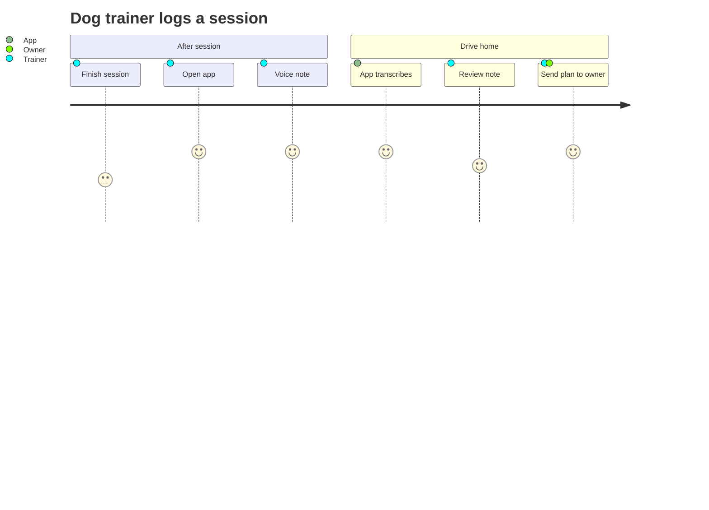
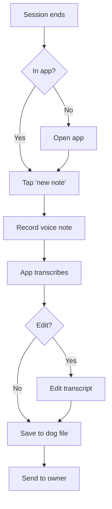
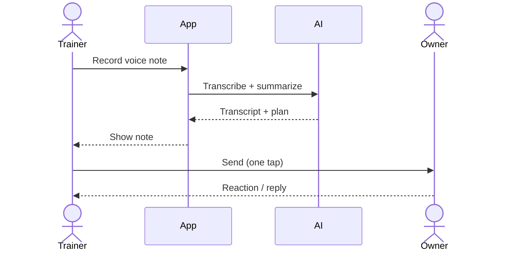

# User Journey

A user journey is the step-by-step path the user takes to get a specific outcome. Write it from the user's point of view — not the system's. Every step is a *moment in the user's day*, not a screen in your app.

## Two views: text + diagram

Always include both in `plan.md`. They serve different readers.

- **Text walkthrough** — narrative, readable, captures emotion and context
- **Mermaid diagram** — visual, scannable, shows the flow at a glance and renders on GitHub

## Text walkthrough — structure

Choose the *primary* user journey for the MVP. Describe it in 6–10 steps. Each step includes:

1. **Trigger** — what prompts the user to start
2. **Context** — where they are (physical, digital, emotional)
3. **Action** — what they do in the product
4. **Outcome** — what they get
5. **Feeling** — how they feel afterward (one word or short phrase)

Example (dog-trainer app):

> **Step 1 — Trigger.** Trainer finishes a 45-minute session with a client's border collie at the owner's home. Dog is still panting, owner is writing her a check.
>
> **Step 2 — Action.** Trainer taps the app icon, taps "new session note." App auto-selects the correct dog from GPS + time.
>
> **Step 3 — Action.** She records a 20-second voice note: "Good progress on recall. Still reactive to bikes. Next: impulse-control drills."
>
> **Step 4 — Outcome.** App transcribes, tags, and files the note under the correct dog.
>
> **Step 5 — Feeling.** Relieved. She's not going to spend her drive home typing notes.
>
> **Step 6 — Follow-through.** On the drive, her app shows the transcribed note with a proposed plan for next session — ready to send to the owner with one tap.

**Quality bar:** if someone reads this and can't picture the user's day, rewrite.

## Mermaid diagram — syntax

GitHub renders Mermaid natively in Markdown. Use `journey` or `flowchart` depending on what you want to show.

### `journey` diagram — good for emotional arc

Score (1–5) = how the user feels at that step. Use this for consumer-facing journeys where emotion matters.

### `flowchart` diagram — good for decisions and branches

Use for any flow with branches, decisions, or system-vs-user actions.

### `sequenceDiagram` — for multi-party flows

Use for marketplaces, multi-sided, or system-with-external-actors.

## Which journeys to include

In the MVP phase:
- **Only the primary journey.** One. Resist adding "also, when the trainer does X..." Don't.

In the v1 phase:
- Primary + 1–2 key secondary journeys (e.g., onboarding, first-time setup)

In the target state:
- A map of all major journeys (usually 3–5). You can link to separate files if each is large.

## Common mistakes

- **System-centric journey.** "Then the backend syncs." Nobody cares. Rewrite from the user's POV.
- **Too many steps.** If it's 20 steps, the journey is too broad. Pick the narrow slice.
- **No emotional context.** Skipping feelings makes the journey feel like a spec, not a story.
- **Journey without a trigger.** Every journey starts with a moment in the user's life. Name it.
- **Happy-path only in a product where failure modes matter.** For critical-task products (health, finance), show at least one failure/recovery path.

## Tie journey to PRD and plan

Each step in the journey should map to a capability in the PRD's "solution shape" section. If a step has no corresponding capability, either the step is aspirational (flag it) or the PRD is incomplete.

In `plan.md`, the phase breakdown should reference specific journey steps: "MVP covers journey steps 1–6; v1 adds steps 7–10 and the owner-reply flow."
